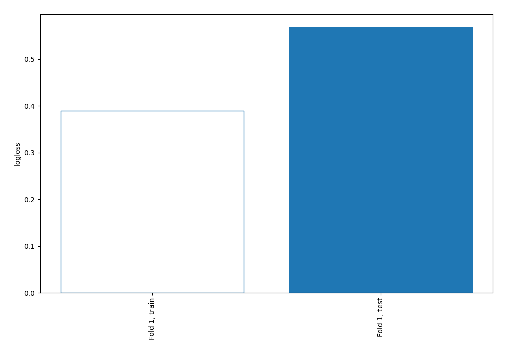
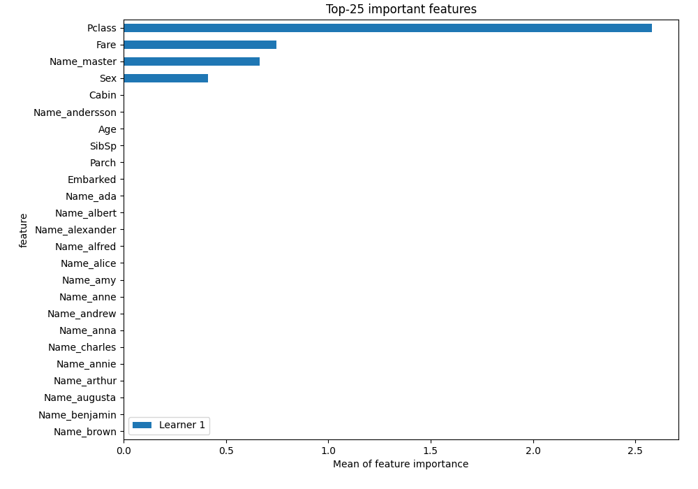
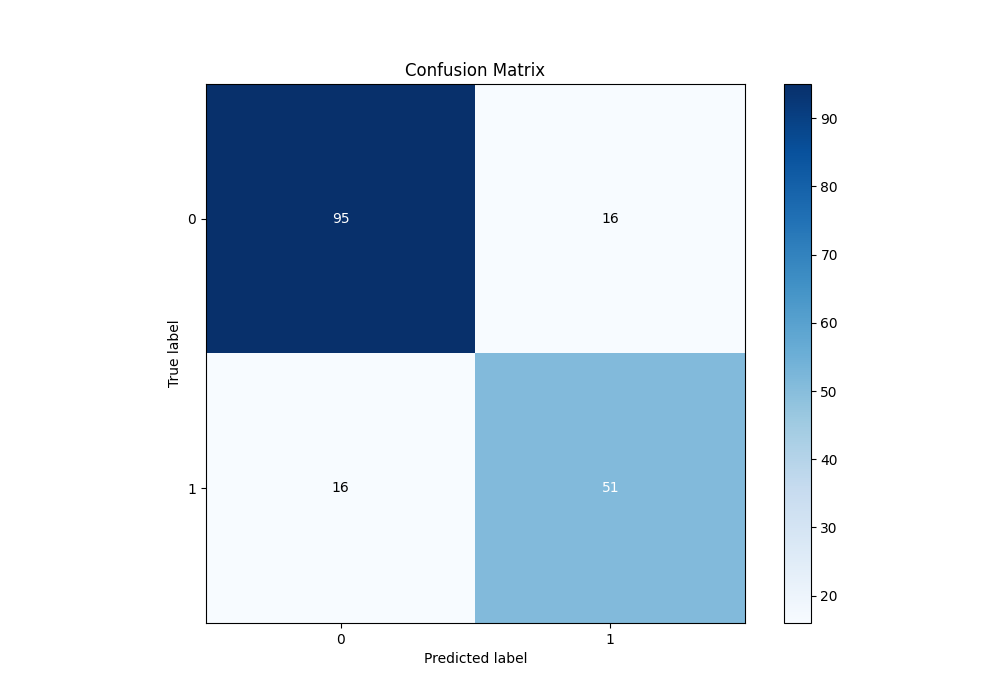
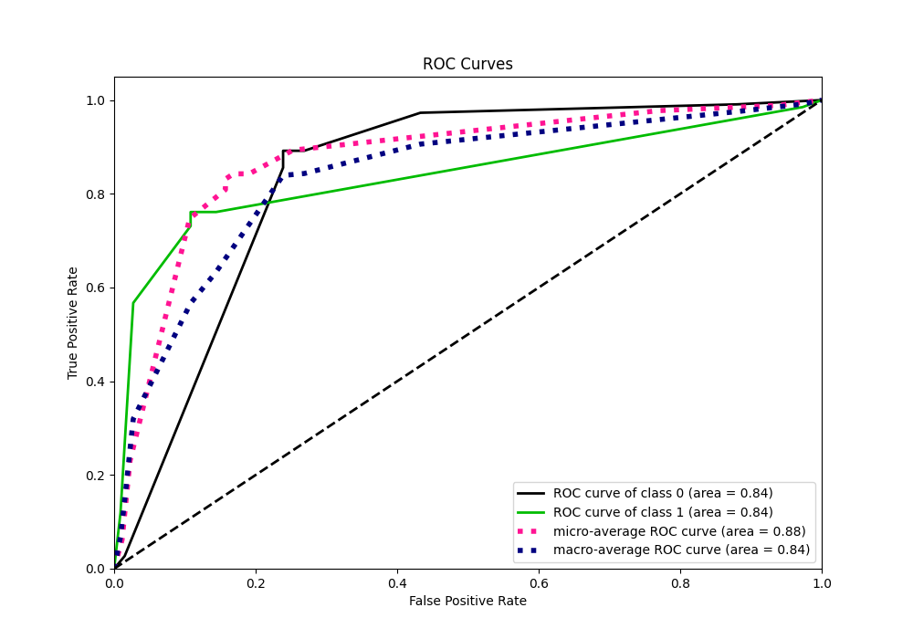
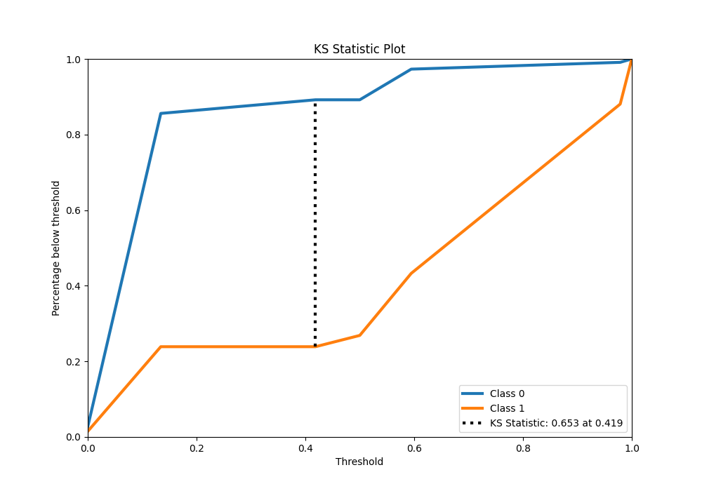
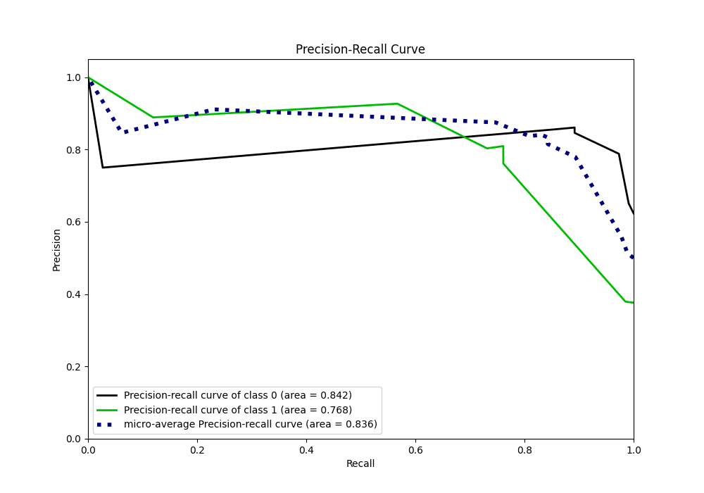
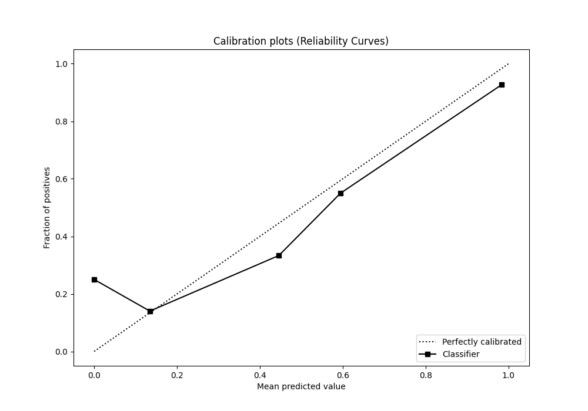
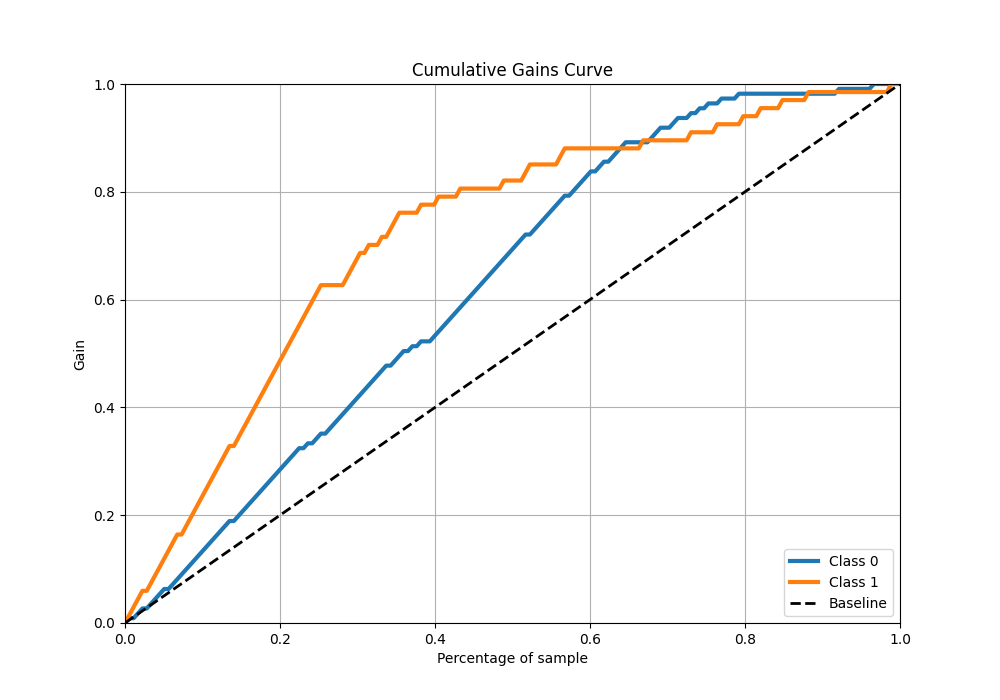
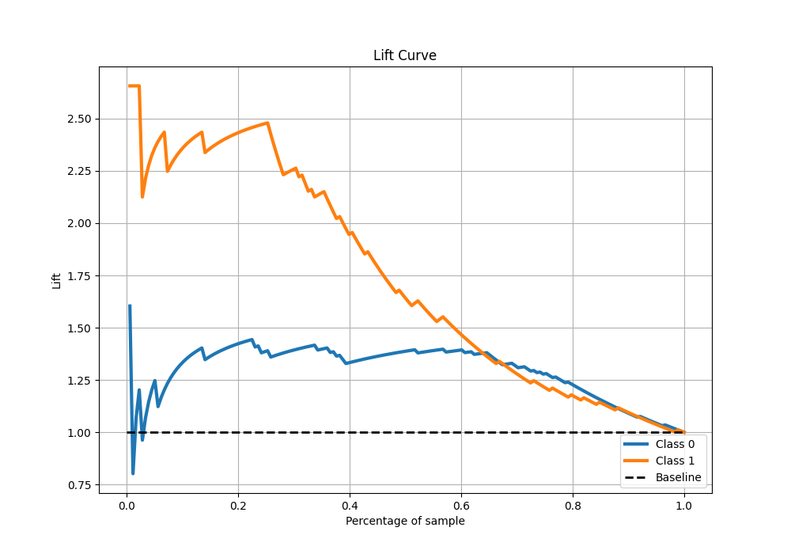

# Summary of 2_DecisionTree

[<< Go back](../README.md)

## Decision Tree
- **n_jobs**: -1
- **criterion**: gini
- **max_depth**: 3
- **explain_level**: 1

## Validation
 - **validation_type**: split
 - **train_ratio**: 0.75
 - **shuffle**: True
 - **stratify**: True

## Optimized metric
logloss

## Training time

4.5 seconds

## Metric details
|           |    score |   threshold |
|:----------|---------:|------------:|
| logloss   | 0.567493 |  nan        |
| auc       | 0.8373   |  nan        |
| f1        | 0.761194 |    0.134228 |
| accuracy  | 0.820225 |    0.134228 |
| precision | 0.761194 |    0.134228 |
| recall    | 0.985075 |    0        |
| mcc       | 0.61705  |    0.134228 |

## Metric details with threshold from accuracy metric
|           |    score |   threshold |
|:----------|---------:|------------:|
| logloss   | 0.567493 |  nan        |
| auc       | 0.8373   |  nan        |
| f1        | 0.761194 |    0.134228 |
| accuracy  | 0.820225 |    0.134228 |
| precision | 0.761194 |    0.134228 |
| recall    | 0.761194 |    0.134228 |
| mcc       | 0.61705  |    0.134228 |

## Confusion matrix (at threshold=0.134228)
|              |   Predicted as 0 |   Predicted as 1 |
|:-------------|-----------------:|-----------------:|
| Labeled as 0 |               95 |               16 |
| Labeled as 1 |               16 |               51 |

## Learning curves

## Permutation-based Importance

## Confusion Matrix

## Normalized Confusion Matrix

## ROC Curve

## Kolmogorov-Smirnov Statistic

## Precision-Recall Curve

## Calibration Curve

## Cumulative Gains Curve

## Lift Curve

[<< Go back](../README.md)
