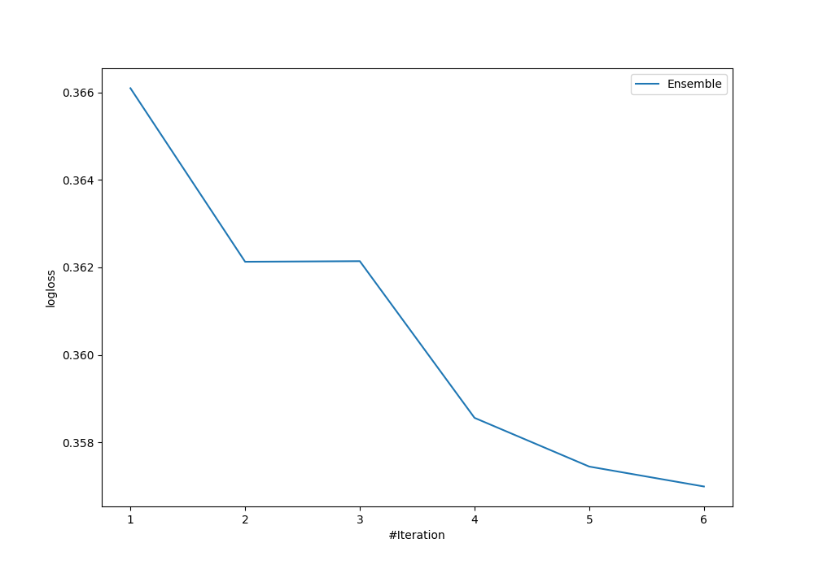
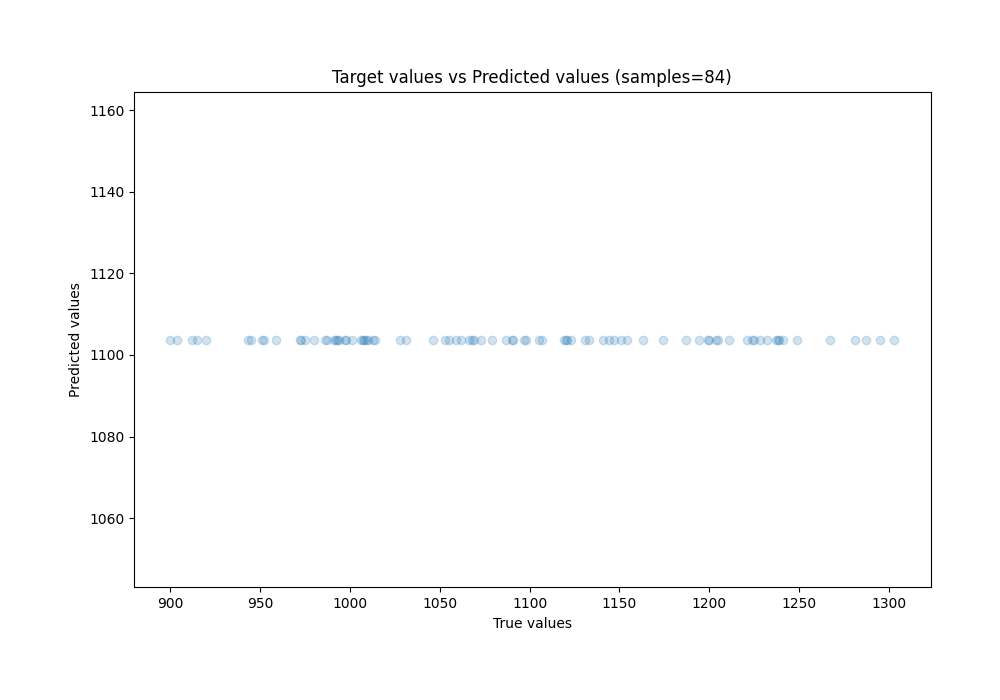
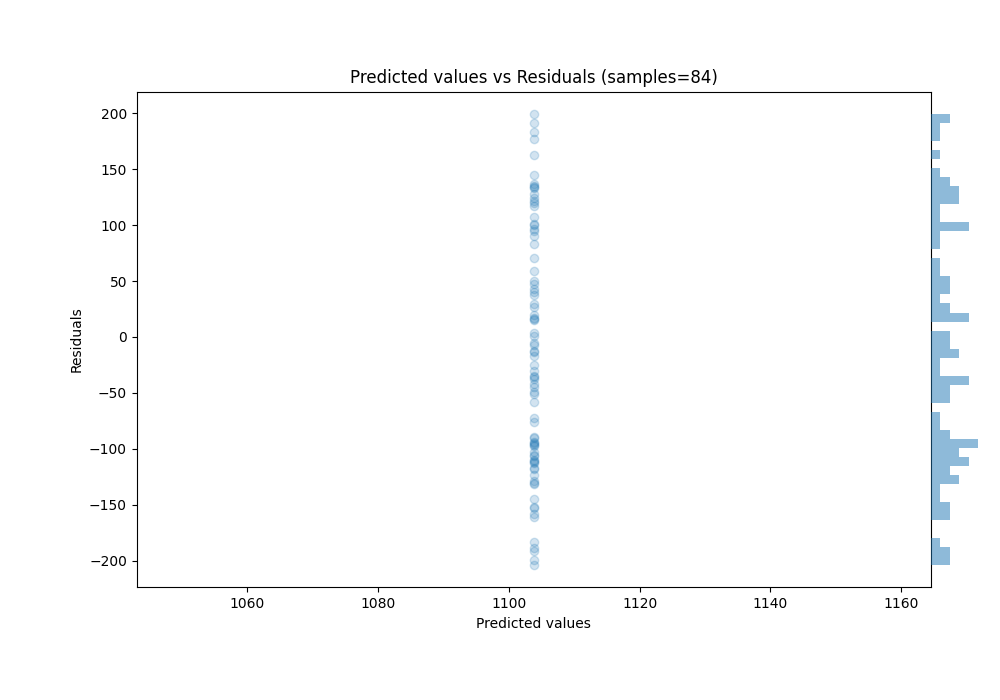

# Summary of Ensemble

[<< Go back](../README.md)

## Ensemble structure
| Model      |   Weight |
|:-----------|---------:|
| 1_Baseline |        1 |

### Metric details:
| Metric   |         Score |
|:---------|--------------:|
| MAE      |    93.7952    |
| MSE      | 11865.1       |
| RMSE     |   108.927     |
| R2       |    -0.0162928 |
| MAPE     |     0.0877836 |

## Learning curves

## True vs Predicted

## Predicted vs Residuals

[<< Go back](../README.md)
