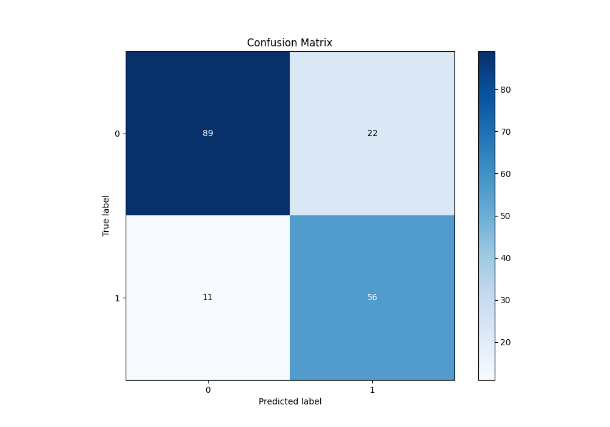
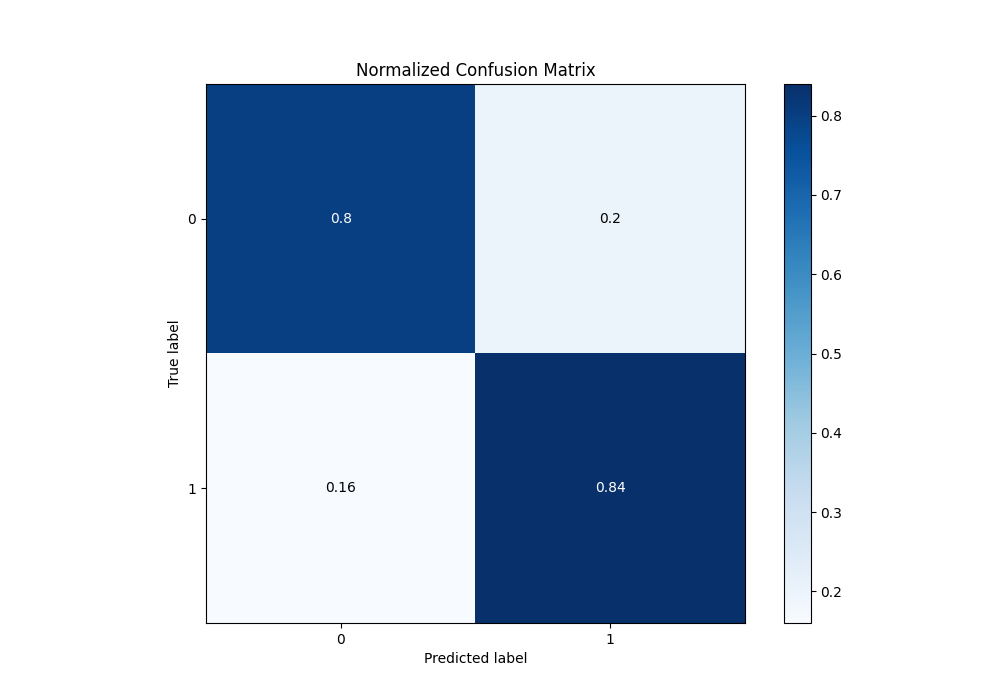
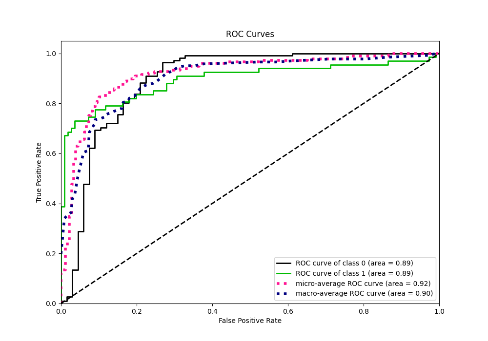
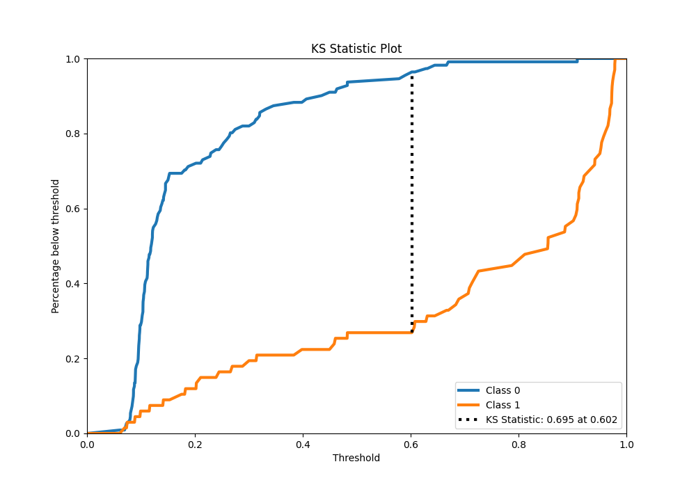
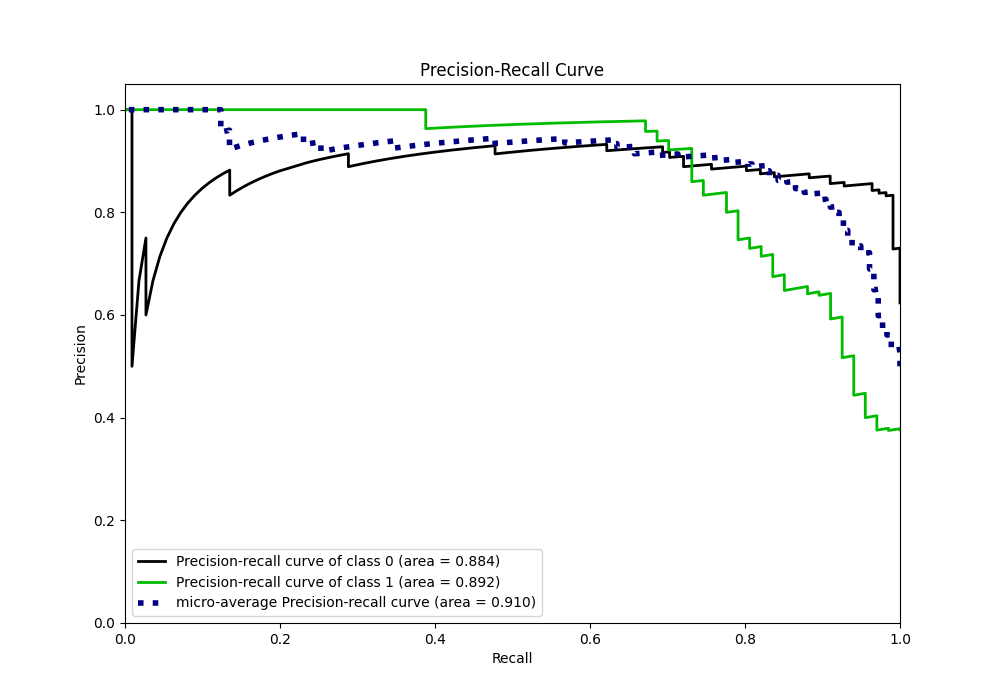
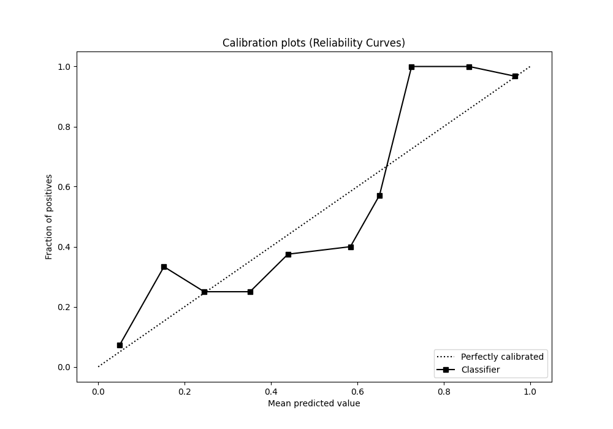
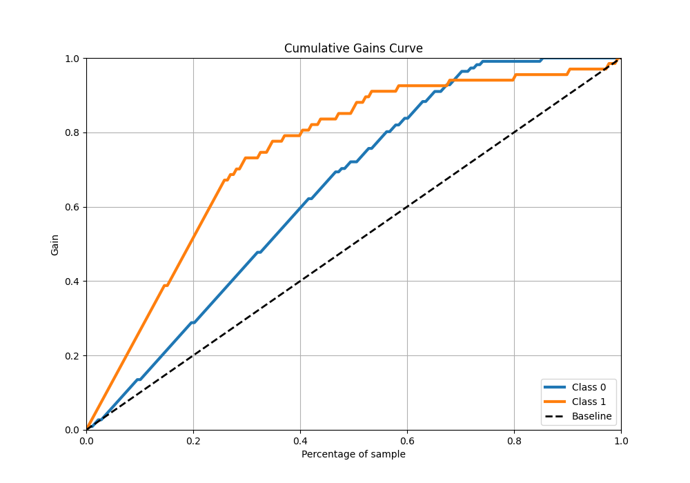
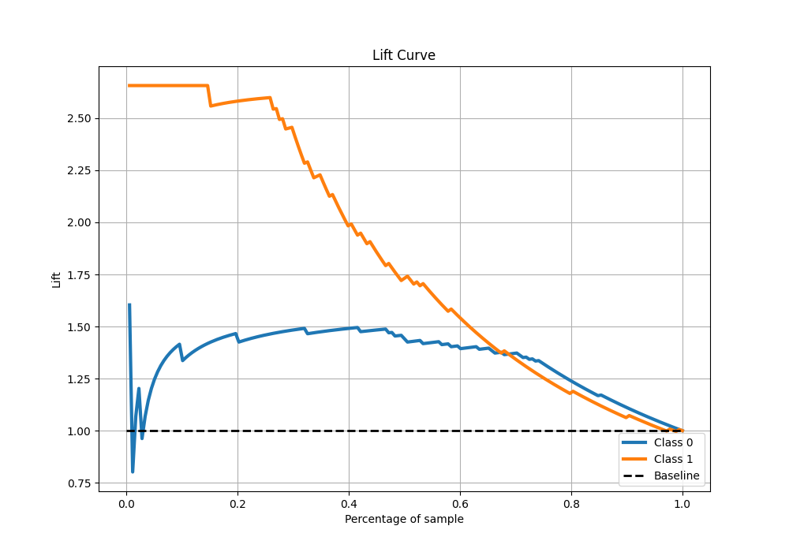

# Summary of Ensemble

[<< Go back](../README.md)

## Ensemble structure
| Model                  |   Weight |
|:-----------------------|---------:|
| 3_Linear               |        1 |
| 4_Default_Xgboost      |        2 |
| 6_Default_RandomForest |        3 |

## Metric details
|           |    score |   threshold |
|:----------|---------:|------------:|
| logloss   | 0.356989 | nan         |
| auc       | 0.89485  | nan         |
| f1        | 0.772414 |   0.267548  |
| accuracy  | 0.814607 |   0.267548  |
| precision | 0.717949 |   0.267548  |
| recall    | 1        |   0.0546534 |
| mcc       | 0.622609 |   0.267548  |

## Metric details with threshold from accuracy metric
|           |    score |   threshold |
|:----------|---------:|------------:|
| logloss   | 0.356989 |  nan        |
| auc       | 0.89485  |  nan        |
| f1        | 0.772414 |    0.267548 |
| accuracy  | 0.814607 |    0.267548 |
| precision | 0.717949 |    0.267548 |
| recall    | 0.835821 |    0.267548 |
| mcc       | 0.622609 |    0.267548 |

## Confusion matrix (at threshold=0.267548)
|              |   Predicted as 0 |   Predicted as 1 |
|:-------------|-----------------:|-----------------:|
| Labeled as 0 |               89 |               22 |
| Labeled as 1 |               11 |               56 |

## Learning curves

## Confusion Matrix

## Normalized Confusion Matrix

## ROC Curve

## Kolmogorov-Smirnov Statistic

## Precision-Recall Curve

## Calibration Curve

## Cumulative Gains Curve

## Lift Curve

[<< Go back](../README.md)
